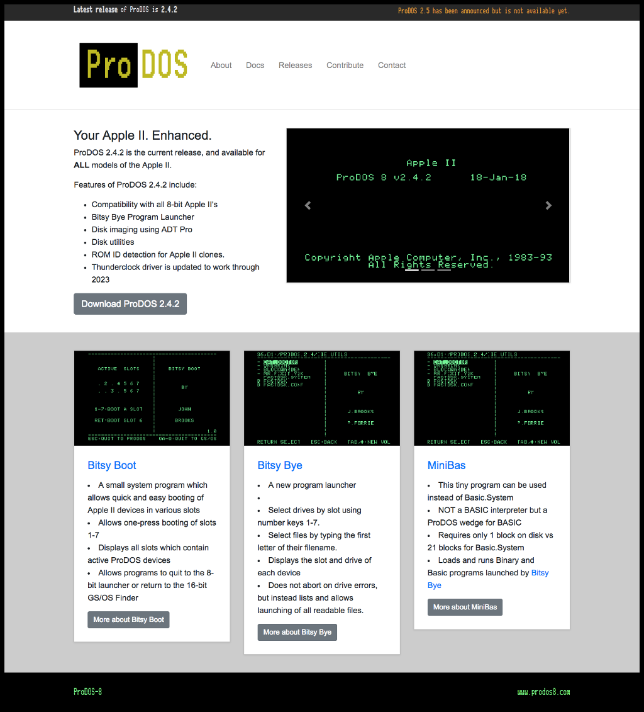

ProDOS-8 Website
================


## Requirements for editing the site


### For editing HTML files-only

* Just a text editor like that respects UNIX newline characters and won't insert a bunch of Windows return chars or old Mac line-endings.
* Decent editors would include things like: **vim**, **nano**, **[Atom](http://atom.io)**, or **[Sublime Text](http://www.sublimetext.com/)**


### Required for building and serving locally 

* The site is built using **[Jekyll](https://jekyllrb.com/)**, *the static website builder*.
* Jekyll allows the site to built dynamically, but served statically.
* A static site makes it easy to host, on something like **AWS S3+CloudFront.**
* The static site is lightning fast to load as there isn't any server-side processing of the page.
* ***To build the site you will need to have Jekyll installed.***
* Jekyll is a ruby-based app, so **Ruby will need to be installed** to support Jekyll.
* Not all versions of Ruby are created equal, *so ensure Ruby is a recent version using **[RVM](http://www.rvm.io/)**.*

```bash
gpg --keyserver hkp://keys.gnupg.net \
    --recv-keys 409B6B1796C275462A1703113804BB82D39DC0E3 \
                7D2BAF1CF37B13E2069D6956105BD0E739499BDB

curl -sSL https://get.rvm.io | bash -s stable

rvm osx-ssl-certs
rvm list known | grep "^\[ruby-\]"
rvm install ruby-2.4.1
rvm list
rvm use ruby-2.4.1

gem install bundler jekyll

```


### Required for rebuilding the CSS using SASS

* SASS is a CSS pre-compiler.
* SASS allows CSS to be built in a sophisticated way allowing re-usable code instead of having redundancies everywhere.
* The CSS is compiled from the source in the **_scss** directory using the [sass precompiler](http://sass-lang.com/).
* SASS is javascript based and **requires [NodeJS](https://nodejs.org/)** to be installed.
* After installing [NodeJS](https://nodejs.org/),  using **npm** to install all the dependencies:


```bash
npm install
```


## Using Gulp to perform functions in a repeatable way


### Using Gulp

* List the available gulp tasks:

```bash
gulp --tasks
gulp --tasks-simple
```


### Running just `gulp` will compile the sass and compile the jekyll site

```bash
gulp
```


### Compile files from _scss into both _site/css *(for live injecting)* and site *(for future jekyll builds)*

```bash
gulp sass
```


### Compile and minify Javascript into one bundle file

```bash
gulp js
```


## Building and Viewing the website locally


### Jekyll can build the site

```bash
jekyll build
```

* After running the **build** command, the site contents will be in the **_site** directory.
* The contents of the _site directory are what would be hosted on something like S3:

```
aws s3 sync _site/ s3://prodos8.com/
```

* GitHub Pages are Jekyll aware, and will take the **_site** directory content to populate a hosted page.


### Jekyll can serve the site

```bash
jekyll serve
```


* After running the **serve** command, Jekyll will start a webserver running on port 4000.
* Point your web browser to http://0.0.0.0:4000/ to view the site.
* The site you see should look something like this:




## Publishing to staging using s3_website

* **s3_website** is a tool designed to publish the **_site** directory, *that Jekyll creates*, to S3 and optionally perform invalidations on cloudfront.


### Install s3_website

* **s3_website** is a **Ruby**-based command that must be installed using **gem**

```bash
gem install s3_website
```


### s3_website configuration

* **s3_website** uses a configuration file, *s3_website.yml*, which is used by s3_website.


FILE: **s3_website.yml**

```yaml
s3_id:     <%= ENV['AWS_ACCESS_KEY_ID'] %>
s3_secret: <%= ENV['AWS_SECRET_ACCESS_KEY'] %>
s3_bucket: prodos8-staging

gzip:
  - .html
  - .css
  - .md
gzip_zopfli: false
```


### AWS Environment Variables

* The s3_website.yml configuration file expects to pull the AWS credentials from two environment variables: **AWS_ACCESS_KEY_ID** and **AWS_SECRET_ACCESS_KEY**
* The easiest way to populate those environment variables is to place them in the ~/.bash_profile.


FILE: **~/.bash_profile**

```bash
export AWS_ACCESS_KEY_ID="AKIxxxxxxxxxxxxx"
export AWS_SECRET_ACCESS_KEY="xxxxxxxxxxxx"
export AWS_REGION="us-east-1"
export AWS_DEFAULT_REGION="us-east-1"
```


* The variables can be set before running s3_website

```bash
export AWS_ACCESS_KEY_ID="AKIxxxxxxxxxxxxx"
export AWS_SECRET_ACCESS_KEY="xxxxxxxxxxxx"

s3_website push
```


### Use s3_website to publish

* With the environment variables set, run the **s3_website push** command

```bash
export AWS_ACCESS_KEY_ID="AKIxxxxxxxxxxxxx"
export AWS_SECRET_ACCESS_KEY="xxxxxxxxxxxx"

s3_website push
```


## Sync a fork of a repository to keep it up-to-date with the upstream repository.

### This BIG-gotcha difference between Stash Bitbucket and GitHub

* BitBucket auto-syncs repo changes from the original to the forked repo.
* Which means once we merge something, everybody gets it automatically and just pulls the latest.
* However, GitHub **does not** do that.
* So your personal fork can get out of sync
* The instructions below will allow you to resync from the upstream master.

### Configure a remote for a fork

* Before you can sync your fork with an upstream repository, you must configure a remote that points to the upstream repository in Git.
* You must configure a remote that points to the upstream repository in Git to sync changes you make in a fork with the original repository.
* This also allows you to sync changes made in the original repository with the fork.

```bash
##
## List the current configured remote repository for your fork.
##
git remote -v

# origin  git@github.com:DevoKun/ProDOS-8.github.io.git (fetch)
# origin  git@github.com:DevoKun/ProDOS-8.github.io.git (push)

##
## Specify a new remote upstream repository that will be synced with the fork.
##
git remote add upstream git@github.com:ProDOS-8/ProDOS-8.github.io.git

##
## Verify the new upstream repository you've specified for your fork.
##
git remote -v

# origin    git@github.com:DevoKun/ProDOS-8.github.io.git (fetch)
# origin    git@github.com:DevoKun/ProDOS-8.github.io.git (push)
# upstream  git@github.com:ProDOS-8/ProDOS-8.github.io.git (fetch)
# upstream  git@github.com:ProDOS-8/ProDOS-8.github.io.git (push)
```

### Fetch from upstream and merge to local master

```bash
git fetch upstream

##
## If not on master, switch to master
## master is not the same as upstream/master
## upstream/master is on github
## master is local to your laptop
##
git branch
git checkout master
git branch
git merge upstream/master
```

### Create a script to resync the branch for you

* Create the file: ~/bin/gitresync
* The contents will be:

```bash
git remote -v

git fetch upstream
git branch
git checkout master
git branch
git merge upstream/master
```


