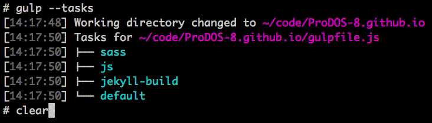
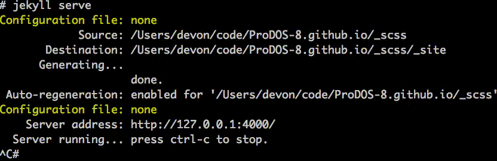

ProDOS-8 Website
================


## Requirements for editing the site


### For editing HTML files-only

* Just a text editor like that respects UNIX newline characters and won't insert a bunch of Windows return chars or old Mac line-endings.
* Decent editors would include things like: **vim**, **nano**, **[Atom](http://atom.io)**, or **[Sublime Text](http://www.sublimetext.com/)**


### Required for building and serving locally 

* The site is built using **[Jekyll](https://jekyllrb.com/)**, *the static website builder*.
* Jekyll allows the site to built dynamically, but served statically.
* A static site makes it easy to host, on something like **AWS S3+CloudFront.**
* The static site is lightning fast to load as there isn't any server-side processing of the page.
* ***To build the site you will need to have Jekyll installed.***
* Jekyll is a ruby-based app, so **Ruby will need to be installed** to support Jekyll.
* Not all versions of Ruby are created equal, *so ensure Ruby is a recent version using **[RVM][http://www.rvm.io/]**.*

```bash
gpg --keyserver hkp://keys.gnupg.net \
    --recv-keys 409B6B1796C275462A1703113804BB82D39DC0E3 \
                7D2BAF1CF37B13E2069D6956105BD0E739499BDB

curl -sSL https://get.rvm.io | bash -s stable

rvm osx-ssl-certs
rvm list known | grep "^\[ruby-\]"
rvm install ruby-2.4.1
rvm list
rvm use ruby-2.4.1

gem install bundler jekyll

```


### Required for rebuilding the CSS using SASS

* SASS is a CSS pre-compiler.
* SASS allows CSS to be built in a sophisticated way allowing re-usable code instead of having redundancies everywhere.
* The CSS is compiled from the source in the **_scss** directory using the [sass precompiler](http://sass-lang.com/).
* SASS is javascript based and **requires [NodeJS](https://nodejs.org/)** to be installed.
* After installing [NodeJS](https://nodejs.org/),  using **npm** to install all the dependencies:


```bash
npm install
```


## Using Gulp to perform functions in a repeatable way


### Using Gulp

* List the available gulp tasks:

```bash
gulp --tasks
gulp --tasks-simple
```




### Running just `gulp` will compile the sass and compile the jekyll site

```bash
gulp
```


### Compile files from _scss into both _site/css *(for live injecting)* and site *(for future jekyll builds)*

```bash
gulp sass
```


### Compile and minify Javascript into one bundle file

```bash
gulp js
```


## Building and Viewing the website locally


### Jekyll can build the site

```bash
jekyll build
```

* After running the **build** command, the site contents will be in the **_site** directory.
* The contents of the _site directory are what would be hosted on something like S3:

```
aws s3 sync _site/ s3://prodos8.com/
```

* GitHub Pages are Jekyll aware, and will take the **_site** directory content to populate a hosted page.


### Jekyll can serve the site

```bash
jekyll serve
```



* After running the **serve** command, Jekyll will start a webserver running on port 4000.
* Point your web browser to http://0.0.0.0:4000/ to view the site.


## Built using Jekyll and Bootstrap 4

- Built on the foundation of the **[jekyll-bootstrap-4](https://github.com/soulroll/jekyll-bootstrap-4)** theme from soulroll


